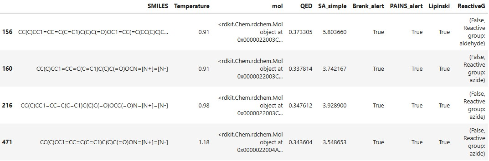
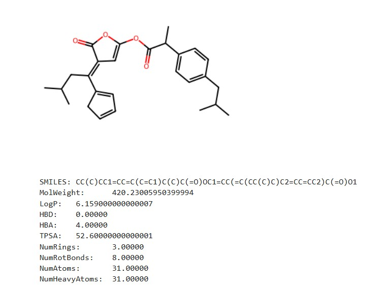
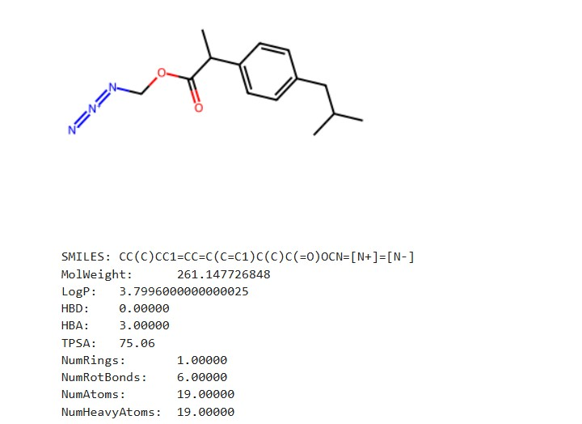
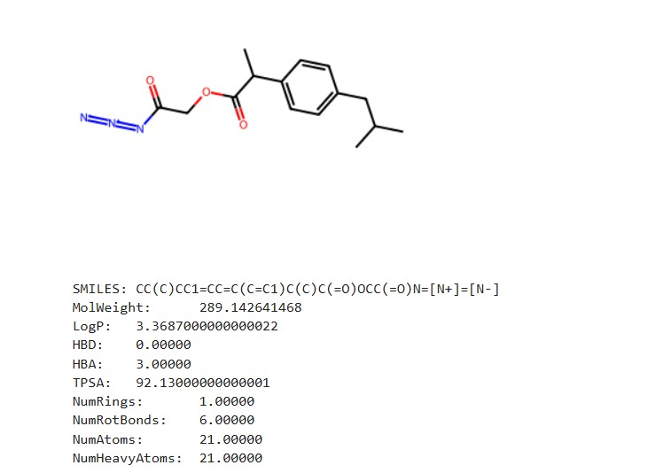
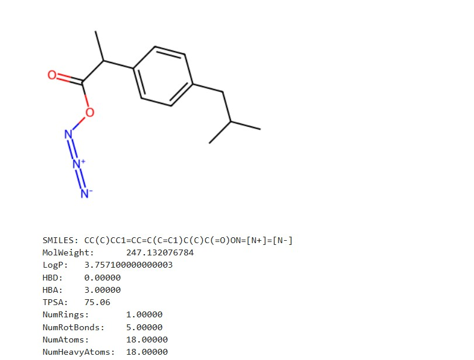

Генерация новых молекул-кандидатов для ингибирования циклооксигеназы-2 (COX-2) с использованием модели **GP-MoLFormer**. Проект включает полный пайплайн: генерацию, фильтрацию и оценку.

## Обзор

Проект демонстрирует применение генеративной модели **GP-MoLFormer-Uniq** для создания новых химических структур на основе известного ингибитора COX-2. Сгенерированные молекулы проходят многоступенчатую фильтрацию:

1. **Генерация** — модель создаёт SMILES-строки
2. **Валидация** — проверка корректности структуры
3. **Фильтрация токсикофоров** — PAINS и Brenk alerts
4. **Оценка по правилу Липински** - классический фильтр для перорально активных препаратов
5. **Оценка drug-likeness** — QED (Quantitative Estimate of Drug-likeness)
6. **Оценка синтетической доступности** — SA Score

## Использование

В качестве шаблона была выбрана молекула Naproxen CC(C)CC1=CC=C(C=C1)C(C)C(=O)O
Генерация происходила на 50 разных температурах от 0.1 до 1.2 по 1000 молекул на каждую температуру.
В результате получилось 509 валидных молекул без дубликатов, что составляет всего 1% от всех молекул. Очевидная проблема с генерацией.
Для фильтрации были выбраны оценки по QED, SA, PAINS, Brenk alerts, Lipinski's Rule of Five, а также оценка на наличие опасных или реакционноспособных: acyl_halide, alkyl_halide, epoxide, azide, nitroso, hydrazine, diazonium, sulfonate_ester, thiol, aldehyde, michael_acceptor.
Первым шагом были отфильтрованы все молекулы, дающие ложноположительные результаты, указывающие на проблемы ADMET и не проходящие по правилу Лепински. Т.е. избавились от наиболее непригодных молекул. Вторым шагом были отобраны по оценке сходства с лекарственными средствами (>0.3 - удовлетворительный результат, которым обладает аспирин). Последним шагом была фильтрация по сложности синтеза (<6 - такие молекулы могут быть сложны для синтеза, но вполне реализуемы).

В итоге получилось отобрать 4 молекулы. Однако все они содержат одну из опасных или реакционноспособных групп, поэтому можно сделать вывод, что эти молекулы нуждаются в доработке.

